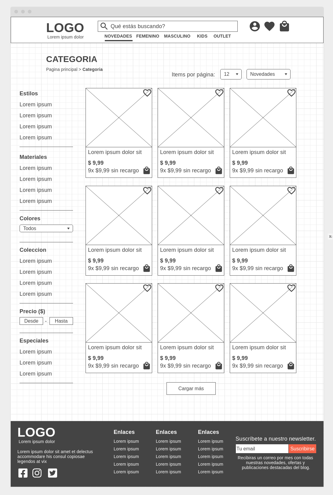

# E-Commerce Loja de Roupa

## Trabalho da materia Interface Humano Computador.

Site desenvolvido com [React](https://reactjs.org/)

Modulos utilizados no projeto:

- [Styled Components](https://styled-components.com/)
- [React Router](https://reactrouter.com/)
- [Swiper](https://swiperjs.com/)

Ferramentas adicionais utilizadas:

- [Wireframes](https://wireframe.cc/)
- [Font Awesome Icons](https://fontawesome.com/)
- [Undraw: Ilustraçao da pagina 404](https://undraw.co/illustrations)
- [FontPair: Escolha de fontes](https://www.fontpair.co/)
- [Coolors: Cores do site](https://coolors.co/)

## Wireframes

Pagina inicial:

Pagina de uma categoria:

Pagina de um produto individual:

## Cores

OBS: O site nao tem toda a sua funcionalidade, foi feito apenas para demonstraçao e apresentaçao.
